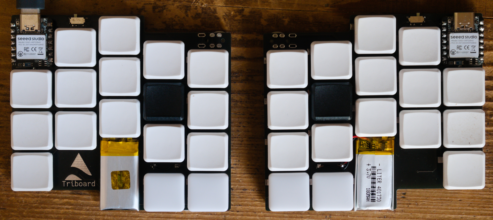

# Triboard

The Triboard is an ergonomic, split mechanical keyboard using hotswappable Kailh Choc switches and any Seeed XIAO compatible controller. Its main feature is being super small and therefore portable, without compromising on ergonomics/usabitity.

[Blog post](https://tarneo.fr/posts/triboard/)



Two builds are possible:
- 34 keys, wireless, with ZMK on XIAO nRF52840 controllers
- 36 keys, wired, with QMK or ZMK on XIAO RP2040 controllers (firmware coming soon !)

> You *could* also theoretically use an ESP based XIAO with KMK and Bluetooth, but it'll be more troublesome than the other two.

Wireless keyboards need to be stripped of one thumb key on each side to make room for the battery.

For now I have only tried a full build with ZMK but KMK seems to work well on ESP32C3 XIAOs.

The PCB is automatically generated with Ergogen and then routed by hand. You could in theory use Freerouting or similar software instead.

A flippable XIAO footprint based on a [similar promicro footprint](https://github.com/50an6xy06r6n/keyboard_reversible.pretty) helps to make the board smaller.

[PCB releases](https://github.com/tarneaux/triboard/releases) are available.

[Link to ZMK config repo](https://github.com/tarneaux/zmk-config-triboard)

## Building the PCB

To build the keyboard with ergogen and open the PCB in KiCad's PCBnew, run:
```sh
npm install
./build.sh # Automatically update the PCB and reopen pcbnew whenever config.yaml changes
```

Here are some things you may want to change:
- Vertical stagger values, defined in the `units` section at the top of the file.
- Hotswappability: I couldn't make the board support both hot-swap sockets and direct switch soldering. Search for `hotswap` in `config.yaml` and adjust accordingly.

## Routing

To make the routing process easier, you can route a single key (diode to via and vias to hotswap socket pads), select all traces (by filtering the selection from the right-click menu) and paste those traces for each key. Then connect the rest according to the KiCad nets as usual.

## Where's the build guide?

As of now I haven't written a build guide. If you want to build this keyboard, just [get in touch with me](https://tarneo.fr/contact/) and I'll be happy to give you some basic instructions.

If you've already built other keyboards yourself, here are some specificities of this one:
- Before soldering the XIAO in, bridge the `[> ]`-shaped pads below it (on the same side of the PCB, so that the XIAO covers the bridged pads).
- When soldering the XIAO, use a short length of insulated wire to connect the battery pad on the PCB (just above the top pinky key) to the positive battery pad below the XIAO. This applies only to wireless builds.

Here's a parts list for a wireless build:
- a pair of flippable PCB's (download gerbers from [releases](https://github.com/tarneaux/triboard/releases/))
- 2 [Seeed XIAO nrf52840 microcontrollers](https://www.seeedstudio.com/Seeed-XIAO-BLE-nRF52840-p-5201.html)
- 2 3.7 v lithium ion batteries with dimensions < 20x30 mm
- 2 [Power switches](https://splitkb.com/products/wireless-controller-expansion-bundle)
- A few round rubber feet, ideally 10 (one per corner, plus one on the bottom middle for thumb key support)
- 4 7-pin rows of [Mill max sockets](https://splitkb.com/products/mill-max-low-profile-sockets)
- For each key (34 if wireless, make sure to get a few extra of each):
  - 1 [diode](https://splitkb.com/products/smd-diodes)
  - 1 kailh choc switch. I like the [ambients](https://splitkb.com/products/ambients-kailh-low-profile-choc-switches)
  - 1 [choc hotswap socket](https://splitkb.com/products/kailh-hotswap-sockets?variant=39472161456205)
  - 1 keycap (make sure to get convex ones for thumb keys, plus two homing ones): I like [blank MBK's](https://splitkb.com/products/blank-mbk-choc-low-profile-keycaps)

## Credits

- Inspiration: keyboards by [GEIGEIGEIST](https://github.com/GEIGEIGEIST), the [chocofi](https://github.com/pashutk/chocofi) and the [samoklava](https://github.com/wxsh/samoklava).
- Videos by Ben Vallack on YouTube.
- Kind people on the [ErgoMechKeyboards](https://lemmy.ml/c/ergomechkeyboards@lemmy.world) Lemmy community.
- FlatFootFox - [Let's Design A Keyboard With Ergogen v4](https://flatfootfox.com/ergogen-introduction/)
